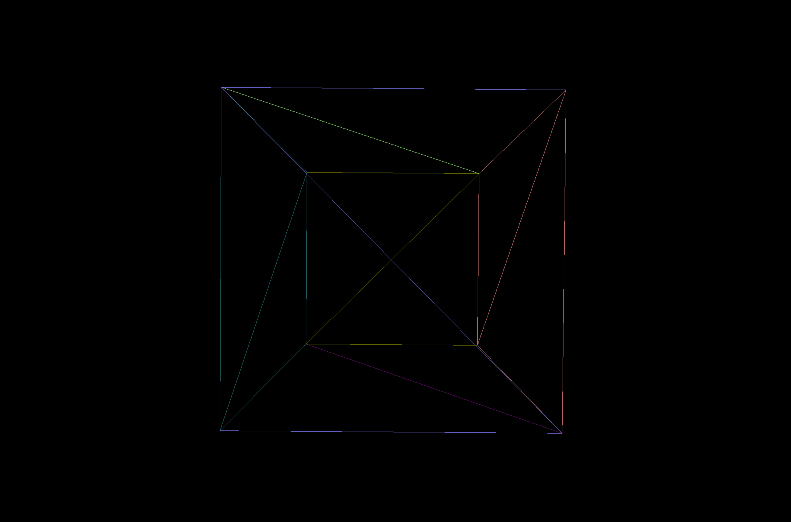

# dkb-ply3d-BoilerPlate
A Three.js Boilerplate for TypeScript - Vite projects

## Boilerplate Overview

When run, the boilerplate shows a multi-coloured wireframe cube.

[Website Link](https://dkbozkurt.github.io/dkb-ply3d-BoilerPlate)



## Installing

```bash
git clone https://github.com/dkbozkurt/dkb-ply3d-BoilerPlate.git
npm install
```

### Develop

```
npm run dev
```

Visit [http://localhost:3000/](http://localhost:3000/)

### Build Production

```bash
npm run build
npm run preview
```

Visit [http://localhost:4173/](http://localhost:4173/)

### Deploy to GitHub pages

If you forked this repository, then you can publish your changes to GitHub pages.

```bash
npm run deploy
```

Visit `https://<your github username>.github.io/ply3d-BoilerPlate/`

E.g.,

[https://dkbozkurt.github.io/dkb-ply3d-BoilerPlate/](https://dkbozkurt.github.io/dkb-ply3d-BoilerPlate/)